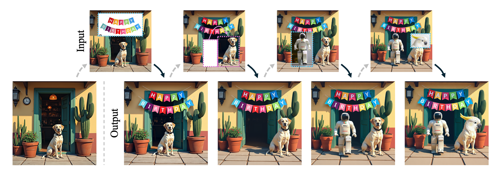

<h1 align="center">LooseRoPE: Content-aware Attention Manipulation for Semantic Harmonization</h1>

<p align="center">
  <a href="https://etaisella.github.io/">Etai Sella</a><sup>1,2</sup> ·
  <a href="https://il.linkedin.com/in/yoavba">Yoav Baron</a><sup>1</sup> ·
  <a href="https://www.hadarelor.com/">Hadar Averbuch-Elor</a><sup>3</sup> ·
  <a href="https://danielcohenor.com/">Daniel Cohen-Or</a><sup>1,2</sup> ·
  <a href="https://orpatashnik.github.io/">Or Patashnik</a><sup>1,2</sup>
</p>

<p align="center">
  <sup>1</sup>Tel Aviv University &nbsp;&nbsp;
  <sup>2</sup>Snap Research &nbsp;&nbsp;
  <sup>3</sup>Cornell University
</p>

<p align="center">
  <a href="https://arxiv.org/abs/2601.05127">
    
  </a>
  
</p>

<p align="center">
  <strong>Unofficial implementation of <a href="https://snap-research.github.io/LooseRoPE/">LooseRoPE</a>.</strong><br>
</p>

## 📚 Table of Contents

1. [Abstract](#abstract)
2. [Setup](#setup)
3. [Quick Start](#quick-start)
4. [Using Your Own Samples](#using-your-own-samples)
5. [Outputs](#outputs)
6. [Citation](#citation)

<a id="abstract"></a>
## 🧩 Abstract

<p align="center">
  
</p>

Recent diffusion-based image editing methods commonly rely on text or high-level instructions to guide the generation process, offering intuitive but coarse control. In contrast, we focus on explicit, prompt-free editing, where the user directly specifies the modification by cropping and pasting an object or sub-object into a chosen location within an image.

This operation affords precise spatial and visual control, yet it introduces a fundamental challenge: preserving the identity of the pasted object while harmonizing it with its new context. We observe that attention maps in diffusion-based editing models inherently govern whether image regions are preserved or adapted for coherence. Building on this insight, we introduce LooseRoPE, a saliency-guided modulation of rotational positional encoding (RoPE) that loosens positional constraints to continuously control the attention field of view.

By relaxing RoPE in this manner, our method smoothly steers the model’s focus between faithful preservation of the input image and coherent harmonization of the inserted object, enabling a balanced trade-off between identity retention and contextual blending.

## ⚙️ Setup

Clone the repository and create the environment:

```bash
git clone https://github.com/etaisella/looserope.git
cd looserope

bash scripts/setup_environment.sh
conda activate looserope
```

Before running for the first time, accept the [FLUX.1-Kontext-dev license](https://huggingface.co/black-forest-labs/FLUX.1-Kontext-dev) and authenticate with Hugging Face:

```bash
hf auth login
```

If your models are already cached somewhere shared, point Hugging Face to that cache:

```bash
export HF_HOME=/path/to/hf_cache
```

For fully cached/offline machines:

```bash
export HF_HUB_OFFLINE=1
export TRANSFORMERS_OFFLINE=1
export DIFFUSERS_OFFLINE=1
```

<a id="quick-start"></a>
## 🚀 Quick Start

Run the default demo:

```bash
python inference.py --override --no_wandb
```

The result will be saved to:

```text
outputs/giraffeduck/output.png
```

Run all demo examples:

```bash
python inference.py data/demo \
  --output_folder outputs/demo_sweep \
  --override \
  --no_wandb
```

<a id="using-your-own-samples"></a>
## 🗂️ Using Your Own Samples

A sample folder can contain an original scene and a pasted-input image:

```text
my_sample/
  original.png
  input.png
```

Then run:

```bash
python inference.py data/examples/my_sample \
  --output_folder outputs/my_sample \
  --override \
  --no_wandb
```

If the auxiliary files are missing, LooseRoPE will prepare them from `original.png` and `input.png`.

You can also provide a precomputed mask instead of the original image:

```text
my_sample/
  input.png
  crop_mask.npy
```

That is enough for the mask-aware inference path. The original image is still needed only for options that explicitly use it, such as `--remove_crop_bg`.

<a id="outputs"></a>
## 📦 Outputs

By default, each sample output folder is intentionally small:

```text
outputs/<sample>/
  output.png
  vlm_verdicts.txt
  timing_summary.txt
```

Decoded x0 predictions are opt-in. To save them, set `save_x0_predictions: true` and choose `x0_prediction_steps` in `configs/attn_config.yaml`.

<a id="citation"></a>
## 📖 Citation

If you find LooseRoPE useful, please cite:

```bibtex
@article{sella2026looserope,
  title={LooseRoPE: Content-aware Attention Manipulation for Semantic Harmonization},
  author={Sella, Etai and Baron, Yoav and Averbuch-Elor, Hadar and Cohen-Or, Daniel and Patashnik, Or},
  journal={arXiv preprint arXiv:2601.05127},
  year={2026}
}
```
